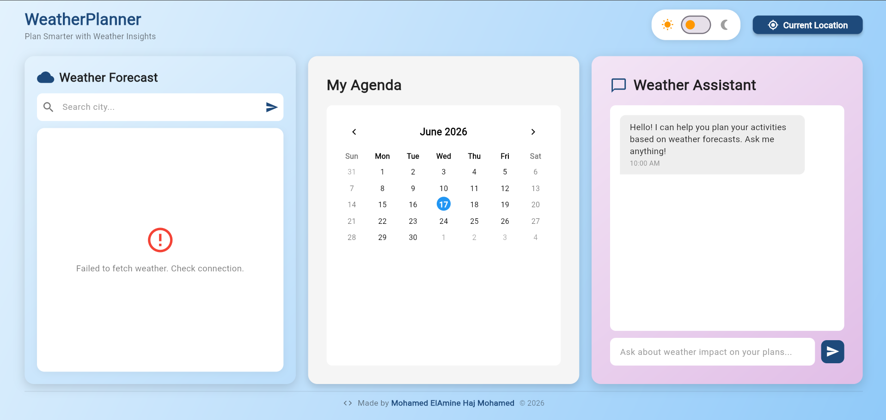
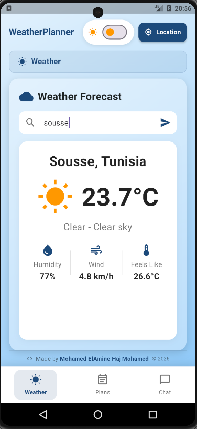
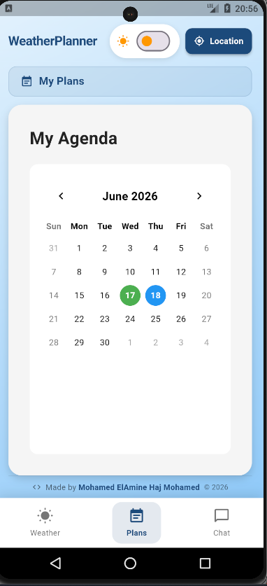
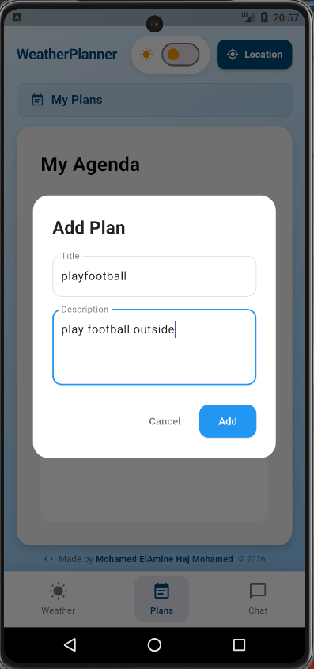
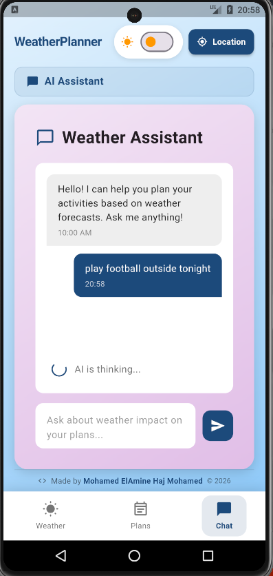
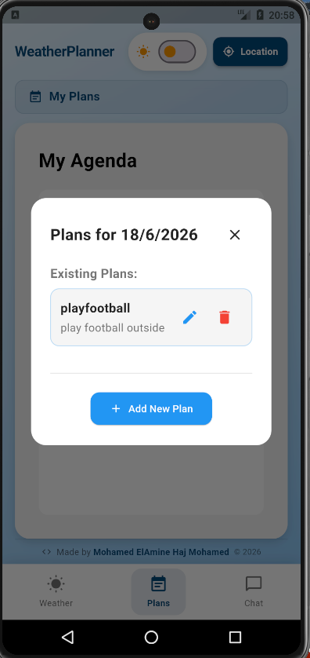
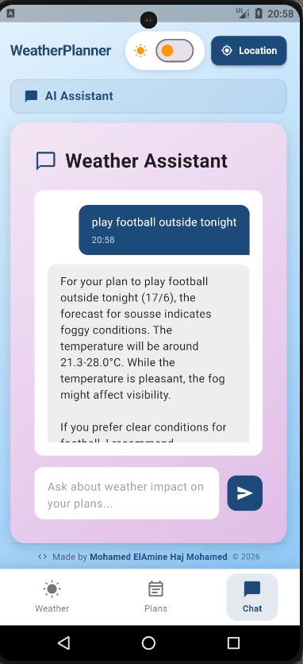
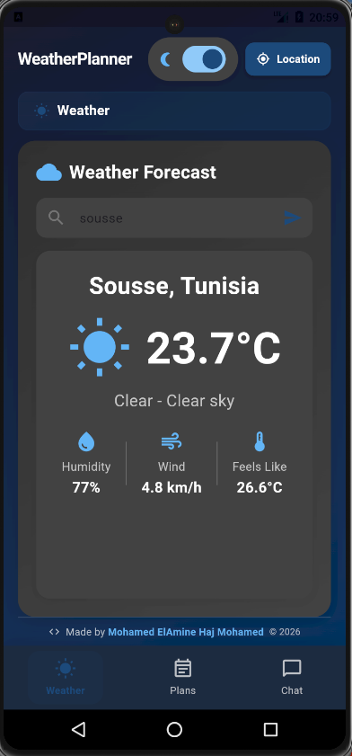
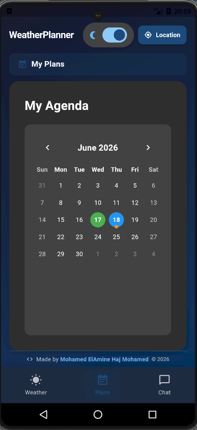
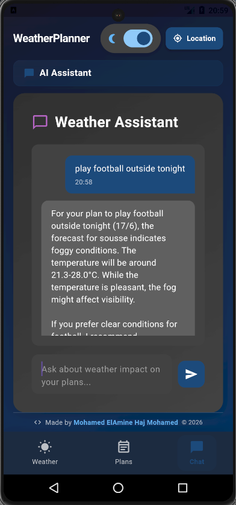

# 🌤️ WeatherPlanner — Plan Smarter with Weather Insights

> An intelligent weather-based task planning app that combines real-time weather forecasts with AI-powered recommendations to help you plan your activities smarter.

<br/>

## 📸 Screenshots

### 🖥️ Web App

| Dashboard |
|-----------|
|  |

<br/>

### 📱 Mobile App — Light Mode

| Screen 1 | Screen 2 | Screen 3 |
|----------|----------|----------|
|  |  |  |

| Screen 4 | Screen 5 | Screen 6 |
|----------|----------|----------|
|  |  |  |

<br/>

### 🌙 Dark Mode

| Dark 1 | Dark 2 | Dark 3 |
|--------|--------|--------|
|  |  |  |

<br/>

---

## 🚀 Features

- 🌡️ **Real-time Weather** — Current conditions and 7-day forecast powered by [Open-Meteo](https://open-meteo.com/) (no API key required)
- 📍 **GPS Location** — Automatically fetch weather for your current location
- 🔍 **City Search** — Search weather for any city worldwide
- 📅 **Task Planning (Agenda)** — Create, edit, and delete plans with specific dates
- 🤖 **AI Assistant** — Gemini-powered chatbot that cross-references your plans with the forecast and gives actionable advice
- 🌙 **Dark / Light Mode** — Full theme support across all screens
- 📱 **Fully Responsive** — Bottom navigation on mobile, multi-column layout on tablet and desktop

<br/>

---

## 🏗️ Tech Stack

### Frontend
| Technology | Purpose |
|------------|---------|
| Flutter | Cross-platform UI framework |
| Dart | Programming language |
| flutter_screenutil | Responsive sizing |
| geolocator | GPS location access |

### Backend
| Technology | Purpose |
|------------|---------|
| FastAPI | REST API framework |
| Python | Programming language |
| MongoDB + Motor | Database (async driver) |
| Open-Meteo API | Free weather data (no key needed) |
| Google Gemini AI | AI chat (gemini-2.5-flash) |
| httpx | Async HTTP client |

<br/>

---

## 📁 Project Structure

```
weather-planner/
├── .gitignore                  # Root gitignore
├── README.md                   # This file
├── screenshots/                # App screenshots
│   ├── web/
│   └── mobile/
│
├── frontend/                   # Flutter app
│   ├── lib/
│   │   ├── main.dart
│   │   ├── dashboard_page.dart
│   │   ├── weatherPage.dart
│   │   ├── agendaPage.dart
│   │   ├── chatbotwidget.dart
│   │   ├── models/
│   │   │   ├── plan_model.dart
│   │   │   └── weather_model.dart
│   │   └── services/
│   │       └── Api.dart
│   ├── pubspec.yaml
│   └── .gitignore
│
└── backend/                    # FastAPI server
    ├── main.py
    ├── requirements.txt
    ├── .env.example
    └── .gitignore
```

<br/>

---

## ⚙️ Getting Started

### Prerequisites

- [Flutter SDK](https://flutter.dev/docs/get-started/install) (3.x+)
- [Python](https://www.python.org/) (3.10+)
- [MongoDB](https://www.mongodb.com/) (local or Atlas)
- [Gemini API Key](https://aistudio.google.com/app/apikey) (free)

<br/>

### 🔧 Backend Setup

```bash
# 1. Navigate to backend folder
cd backend

# 2. Create virtual environment (recommended)
python -m venv venv
source venv/bin/activate      # Mac/Linux
venv\Scripts\activate         # Windows

# 3. Install dependencies
pip install -r requirements.txt

# 4. Create your .env file
cp .env.example .env
# Then edit .env and add your keys
```

**.env file:**
```env
GEMINI_API_KEY=your_gemini_api_key_here
MONGODB_URL=mongodb://localhost:27017/fastApi_ToDoApp
```

```bash
# 5. Make sure MongoDB is running
mongod
# or with Docker:
docker run -d -p 27017:27017 mongo

# 6. Start the server
uvicorn main:app --reload
```

Backend runs at → `http://localhost:8000`
API docs at → `http://localhost:8000/docs`

<br/>

### 📱 Frontend Setup

```bash
# 1. Navigate to frontend folder
cd frontend

# 2. Install Flutter dependencies
flutter pub get

# 3. Run on web (development)
flutter run -d chrome

# 4. Run on mobile (with device connected)
flutter run
```

> ⚠️ Make sure the backend is running before launching the frontend. Update the base URL in `lib/services/Api.dart` if needed.

<br/>

---

## 🌐 API Endpoints

### Plans
| Method | Endpoint | Description |
|--------|----------|-------------|
| GET | `/plans/getallplans/` | Get all plans |
| POST | `/plans/addplan/` | Create a new plan |
| PUT | `/plans/modifyplan/{id}` | Update a plan |
| DELETE | `/plans/deleteplan/{id}` | Delete a plan |
| GET | `/plans/search/{title}` | Search plans by title |

### Weather
| Method | Endpoint | Description |
|--------|----------|-------------|
| GET | `/weather/current/{city}` | Current weather by city |
| GET | `/weather/forecast/{city}` | 7-day forecast by city |
| GET | `/weather/current/coords?lat=&lon=` | Current weather by coordinates |
| GET | `/weather/forecast/coords?lat=&lon=` | Forecast by coordinates |

### AI Chat
| Method | Endpoint | Description |
|--------|----------|-------------|
| POST | `/chat/ask` | Send message to Gemini AI with weather+plans context |

<br/>

---

## 🤖 How the AI Works

The AI assistant receives a combined context string containing:
1. Current weather conditions
2. 7-day forecast data
3. All user plans with their dates

It then cross-references plan dates with forecast dates to give specific, actionable advice like:

> *"Your 'Beach Trip' on Friday has rain forecasted (15°C). I'd recommend rescheduling to Sunday when it's sunny and 26°C."*

<br/>

---

## 📦 Deployment

### Backend (Render)
1. Push code to GitHub
2. Create a new **Web Service** on [Render](https://render.com)
3. Set build command: `pip install -r requirements.txt`
4. Set start command: `uvicorn main:app --host 0.0.0.0 --port 8000`
5. Add environment variables (`GEMINI_API_KEY`, `MONGODB_URL`)

### Frontend (Firebase Hosting)
```bash
cd frontend
flutter build web
firebase deploy
```

<br/>

---

## 👨‍💻 Author

**Mohamed ElAmine Haj Mohamed**
- 🎓 AI & Data Science Engineering Student — EPI International Multidisciplinary School, Tunisia
- 💼 Seeking AI/ML Internship — July 2026

<br/>

---

## 📄 License

This project is open source and available under the [MIT License](LICENSE).